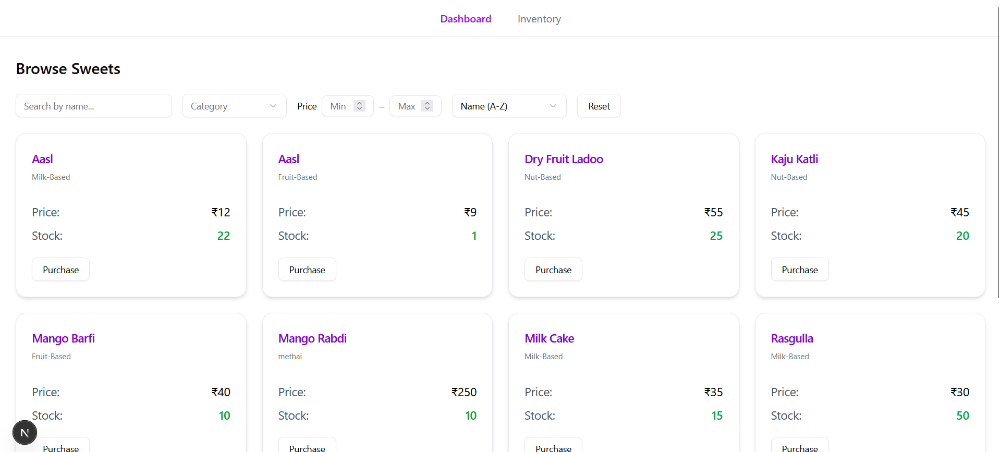

# Sweet Shop Management System

- A sweet shop management system built using **Next.js (App Router)**, **Prisma ORM**, **ShadCN UI**, and **TypeScript**. This application provides functionality for managing sweets including add, view, purchase, delete, restock, search, and sort operations with robust testing using **Jest**.

## Features

### Sweet Management

- ✅ Add a new sweet
- ✅ View all sweets
- ✅ Delete a sweet
- ✅ Purchase a sweet (decrease stock)
- ✅ Restock a sweet (increase stock)

### Search & Sort

- ✅ Filter sweets by name, category, and price range
- ✅ Sort by name, price, category (asc/desc)

## Tech Stack

| Layer        | Technology                                                |
| ------------ | --------------------------------------------------------- |
| **Frontend** | Next.js (App Router), TypeScript, Tailwind CSS, ShadCN UI |
| **Backend**  | Next.js API Routes (using Route Handlers), TypeScript     |
| **Database** | SQLite (via Prisma ORM)                                   |
| **Testing**  | Jest (Unit + API Route tests), with TDD approach          |

---

## API Endpoints

All API routes follow REST conventions and live under `/api/sweets`.

| Method   | Endpoint                   | Description                        | Payload / Query                                         |
| -------- | -------------------------- | ---------------------------------- | ------------------------------------------------------- |
| `POST`   | `/api/sweets/add`          | Add a new sweet                    | `{ name, price, quantity, categoryId }`                 |
| `GET`    | `/api/sweets`              | Get all sweets with filters & sort | `?name=katli&category=Milk&minPrice=10&sort=price_desc` |
| `DELETE` | `/api/sweets/delete/[:id]` | Delete sweet by ID                 | URL param: `id`                                         |
| `POST`   | `/api/sweets/purchase`     | Purchase sweet and reduce stock    | `{ sweetId, quantity }`                                 |
| `PUT`    | `/api/sweets/restock`      | Restock sweet by amount            | `{ sweetId, quantity }`                                 |

### Search Parameters

| Query Param | Type   | Description                                        |
| ----------- | ------ | -------------------------------------------------- |
| `name`      | string | Partial sweet name (case-insensitive)              |
| `category`  | string | Category name                                      |
| `minPrice`  | number | Minimum price filter                               |
| `maxPrice`  | number | Maximum price filter                               |
| `sort`      | string | `price_asc`, `price_desc`, `name_asc`, `name_desc` |

---

## Getting Started

Follow these steps to set up and run the **Sweet Shop Management System** locally.

---

### Prerequisites

- **Node.js** (v18 or later)
- **npm** or **yarn**
- No external database setup required — uses **SQLite** by default

---

### Clone the Repository

```bash
git clone https://github.com/HetSolanki/Sweet-Shop.git
```

---

### Install Dependencies

Using **npm**:

```bash
npm install
# or
yarn install
```

---

### Set Up the Database

Generate the Prisma client:

```bash
npx prisma generate
```

Run migrations to create the initial database schema:

```bash
npx prisma migrate dev --name init
```

---

### Seed Sample Data (Optional)

Seed the database with demo data:

```bash
npx prisma db seed
```

---

### Run the Development Server

Start the application:

```bash
npm run dev
```

Then open your browser and visit:

```
http://localhost:3000
```

---

## UI Pages

- `/`: Home page — display sweets with purchase option
- `/inventory`: Admin view with Add / Edit / Delete / Restock buttons
- Dynamic popups for **purchase**, **delete confirmation**, and **toast notifications**

## 🖼️ UI Preview

<table width="100%">
  <tr>
    <td align="center">
      <strong>Home Page</strong><br/>
      
    </td>
    <td align="center">
      <strong>Inventory</strong><br/>
      
    </td>
  </tr>
  <tr>
    <td align="center">
      <strong>Add Sweet</strong><br/>
      
    </td>
    <td align="center">
      <strong>Add Category</strong><br/>
      
    </td>
  </tr>
  <tr>
    <td align="center">
      <strong>Purchase</strong><br/>
      
    </td>
    <td align="center">
      <strong>Restock</strong><br/>
      
    </td>
  </tr>
  <tr>
    <td align="center">
      <strong>Delete</strong><br/>
      
    </td>
    <td align="center">
      <!-- Empty column -->
    </td>
  </tr>
</table>

## Testing

Run full test suite with:

```bash
npm run test
```

### Test Coverage

- ✅ Unit tests for all API routes (`tests/api/*`)
- ✅ Validation scenarios (missing fields, invalid data)
- ✅ Edge cases: zero stock, invalid categories, negative price/quantity

## Test Suites Overview

### `tests/api/sweets/add.test.ts`

Validates the `POST /api/sweets/add` API:

- Adds new sweets
- Handles invalid input and missing categories

### `tests/api/sweets/delete.test.ts`

Covers `DELETE /api/sweets/delete/[id]`:

- Deletes sweets by ID
- Handles non-existent IDs gracefully

### `tests/api/sweets/search.test.ts`

Tests `GET /api/sweets` search & sort:

- Filters by name, category, price
- Supports sorting (name/price)
- Handles no-result scenarios

### `tests/api/sweets/purchase.test.ts`

Verifies `POST /api/sweets/purchase` logic:

- Reduces stock quantity
- Prevents over-purchase & invalid input

### `tests/prismainit.test.ts`

Checks Prisma initialization:

## Test Coverage Report

|  |
| :----------------------------------------------: |
|  |
|  |
|  |

---

## Author

Developed by **Het Solanki** as part of Incubyte assessment.
